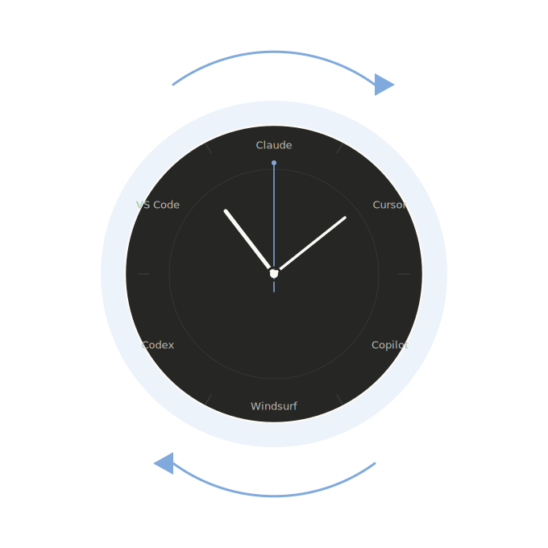

<div align="center">



# Catchup

The AI tooling ecosystem moves fast — new releases, features, and tools drop daily. Catchup gives you a single command to get a consolidated briefing of what changed across the tools you care about.

</div>

## Installation

**Claude Code:**
```bash
claude plugin install https://github.com/xanoysky/catchup-claude-plugin.git
```

**GitHub Copilot CLI:**
```bash
copilot plugin install https://github.com/xanoysky/catchup-claude-plugin.git
```

**Or inside a session:**
```
/plugin add https://github.com/xanoysky/catchup-claude-plugin.git
```

**APM (Agent Package Manager):**
```bash
apm install xanoysky/catchup-claude-plugin
```

## Usage

### Fetch changelogs

| Command | Description |
|---------|-------------|
| `/catchup` | Fetch all sources |
| `/catchup claude,codex` | Only specific tools |

### Manage sources

| Command | Description |
|---------|-------------|
| `/catchup --add "Cursor" https://www.cursor.com/changelog` | Add a source |
| `/catchup --remove cursor` | Remove a source |
| `/catchup --list` | Show current sources |
| `/catchup --reset` | Restore defaults |

> [!NOTE]
> Defaults: Claude Code, GitHub Copilot, OpenAI Codex, Gemini CLI, Cursor, OpenClaw. Add or remove anything you want.

## Supported Platforms

| Platform | Status |
|----------|--------|
| Claude Code CLI | ✅ |
| GitHub Copilot CLI | ✅ |
| Cursor CLI | ✅ |
| VS Code IDE | ✅ |
| OpenAI Codex CLI | 🔜 |
| IntelliJ IDEA | 🔜 |
